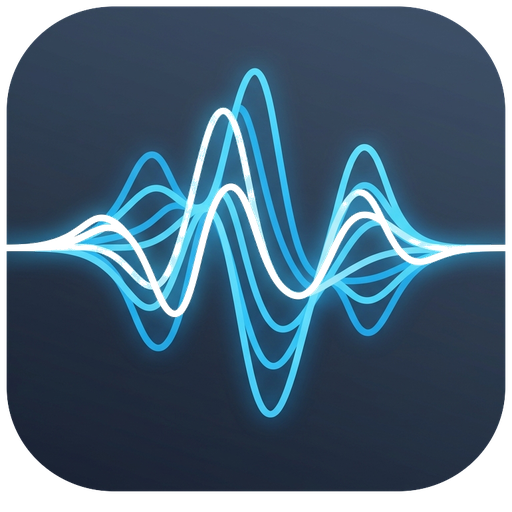

<div align="center">
  
  <h1>🎵 Nexus Audio</h1>
  <p><strong>A Modern, Beautiful, and Feature-Rich Music Player & Downloader built with Electron.</strong></p>

  <p>
    <a href="https://github.com/yayapat/nexus-audio/releases/latest"></a>
    <a href="https://github.com/yayapat/nexus-audio/blob/master/LICENSE"></a>
    
    
  </p>
</div>

<br />

## ✨ Features

- **Modern User Interface:** Beautiful, glassmorphism-inspired design with seamless Light and Dark mode transitions.
- **Built-in Downloader:** Download music directly using the integrated `yt-dlp` wrapper. Extract MP3, M4A, FLAC, and WAV with ease.
- **10-Band Equalizer:** Fine-tune your audio experience with a custom 10-band EQ and multiple built-in presets (Bass Boost, Acoustic, Pop, Rock, etc.).
- **Mini Player Mode:** Keep your screen real estate clean with a compact, always-on-top mini player.
- **System Integration:** Full support for Global Media Keys, System Tray, and native OS notifications.
- **Playlist Management:** Save, load, and manage your custom music queues easily via drag & drop.

<br />

## 🚀 Installation

### Prerequisites
Make sure you have [Node.js](https://nodejs.org/) installed on your machine.
For the downloader feature to work optimally, you need to have `yt-dlp` and `ffmpeg` installed on your system path.

### Setup

1. **Clone the repository:**
   ```bash
   git clone https://github.com/yayapat/nexus-audio.git
   cd nexus-audio
   ```

2. **Install dependencies:**
   ```bash
   npm install
   ```

3. **Run the application (Development mode):**
   ```bash
   npm run dev
   ```

<br />

## 📦 Building for Production

To build the executable (AppImage and deb for Linux):

```bash
npm run build
```
_Check the `dist` folder for the built binaries._

<br />

## 🛠️ Technology Stack

- [Electron](https://www.electronjs.org/) - Desktop application framework
- [TailwindCSS](https://tailwindcss.com/) - Utility-first CSS framework for styling
- [yt-dlp](https://github.com/yt-dlp/yt-dlp) - Command-line audio/video downloader
- [music-metadata](https://github.com/Borewit/music-metadata) - Audio metadata parser

<br />

## 🤝 Contributing

Contributions, issues, and feature requests are welcome!
Feel free to check [issues page](https://github.com/yayapat/nexus-audio/issues).

<br />

## 📝 License

This project is [MIT](https://github.com/yayapat/nexus-audio/blob/master/LICENSE) licensed.

---
<div align="center">
  <sub>Built with ❤️ by <a href="https://github.com/yayapat">NovaX</a></sub>
</div>
